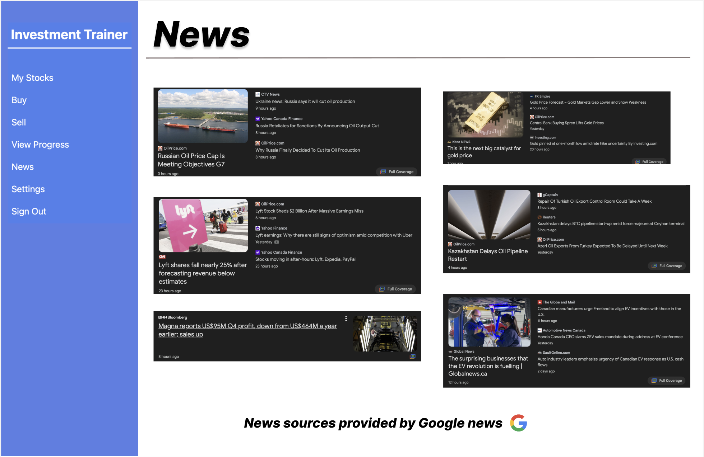

# Wireframe 1 (Balsamiq):

This wireframe describes the functionality of main user screen. The screen displays information such as a list of stocks in the user portfolio, the fluctuation in stock value via a graph, and an overall summary of the users balance.

# Wireframe 2 (Balsamiq):

This wireframe describes the functionality of the learning view. When viewing the graphs the program can show recommendations as to what the user could do to maximize their investing potential. The screen includes a graph with multiple time span options as well as a stock comparison chart where you can select particular stocks at each time.

# Wireframe 3 (Figma):

This wireframe displays an example of what we will mimic our welcome page to be. Where after clicking get started you will be given options such as login and create an account which both will lead to further prompts.

# Wireframe 4 (Figma):

This wireframe describes the functionality of the stock information view. This view will display in depth information regarding a selected stock. Information will include a graph displaying price fluctuations over the selected time period, the active price of the stock, and statistics of the stock such as the market cap, that day's opening bid, the current high and low prices and more.

# Wireframe 5 (Figma):

This wireframe describes the functionality of the news page. The intentions of the news page is to show users current events that could possibly pertain to stock market fluctuations. For example the fluctuation in oil prices due to the invasion of Ukraine. 
