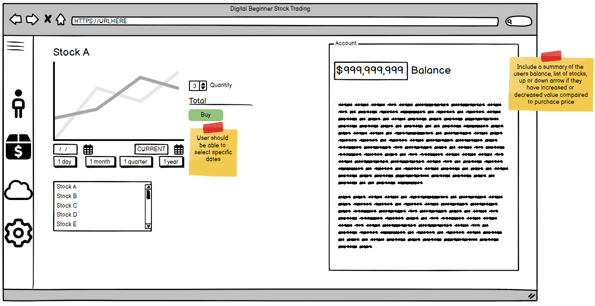
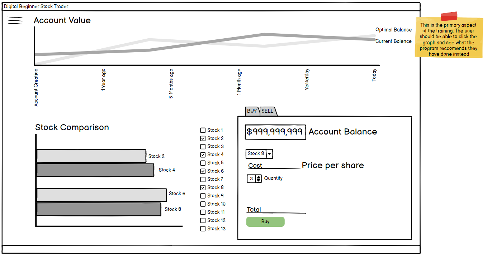
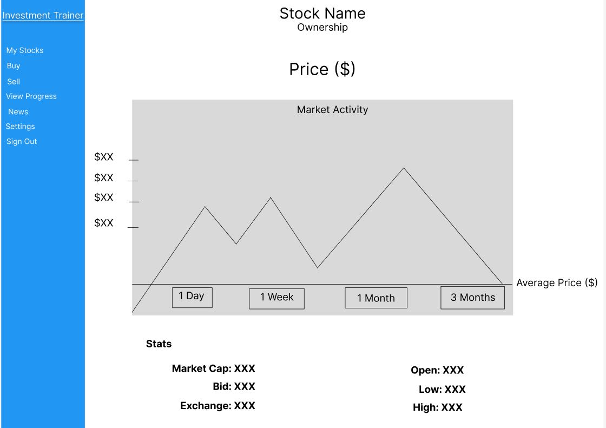

# Wireframe 1 (Balsamiq):

This wireframe describes the functionality of main user screen. The screen displays information such as a list of stocks in the user portfolio, the fluctuation in stock value via a graph, and an overall summary of the users balance.

# Wireframe 2 (Balsamiq):

This wireframe describes the functionality of the learning view. When viewing the graphs the program can show recommendations as to what the user could do to maximize their investing potential. The screen includes a graph with multiple time span options as well as a stock comparison chart where you can select particular stocks at each time.

# Wireframe 3 (Figma):

This wireframe describes the functionality of...

# Wireframe 4 (Figma):

This wireframe describes the functionality of...
